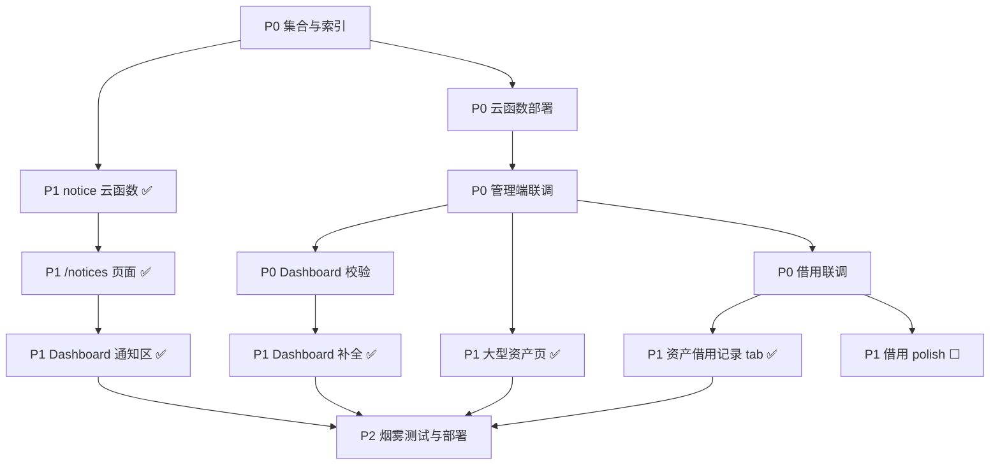

# AMS 管理端工作计划（0702 待办）

> 依据 `README.md`、`docs/` 系列文档及 `.memory/PROGRESS.md` 与现有代码对照整理。  
> **约束**：不改变一期既定架构——前端仍通过 `callFunction` 走云函数；不引入 SDK 直连数据库；不新增/替换 `dashboard`/`init` 等已废弃路径；沿用 `auth` / `asset` / `borrow` / `user` / `notice` 五云函数及 `http.ts` 鉴权注入方式。
>
> **最后更新**：2026-07-02 — P1 功能补全 + P1-D3 CSV 导出代码已恢复；**P0 联调与云端部署尚未完成**。

---

## 一、范围界定

### 1.1 本计划覆盖（管理端 Web）

| 模块 | 路由 | 当前状态 |
|------|------|----------|
| 管理员登录 | `/login` | ✅ 已完成 |
| 看板 | `/` | ✅ 代码完成（总账 / 出入仓 / 四图 / 7·30·90 天 / 通知区）；待 P0-5 联调校验 |
| 资产管理 | `/assets` 系列 | ✅ 代码完成（借用记录 Tab + 状态闸门 + CSV 导出）；待 P0-3 联调 |
| 借用审批 | `/borrows` 系列 | 🟡 约 95%，支持 URL query 预填；待 P0-4 端到端联调 |
| 大型资产 | `/large-assets` | ✅ 代码完成（指标卡 + 列表 + 跳转详情）；待部署后验证 |
| 通知公告 | `/notices` | ✅ 代码完成（`notice` 云函数 + CRUD 页）；待建 `ams_notice` 集合并部署 |
| 用户管理 | `/admins` | ✅ 已完成 |
| 报表 / 闲置共享 | `/reports` `/share` | ⏸ 二期占位，**不纳入本期** |

### 1.2 明确排除

- **教师小程序登录**：`teacherLoginByPassword`、`teacherLoginByOpenid`、微信绑定 UI、借物车/签名/凭证等（均在 `app/` 工作区）
- **架构变更**：SDK 直连白名单、`init` 云函数、独立 `dashboard` 云函数、JWT/多管理员重构
- **二期功能**：AI 报表、闲置共享、扫码入库、Excel 批量导入

### 1.3 架构不变原则（实施时必须遵守）

1. 读写一律走云函数（`src/utils/http.ts` → `callFunction`）
2. Dashboard 统计继续用现有 `asset.summary` + `borrow.summary` + `notice.list`，**不新建** `dashboard` 云函数
3. 图片上传继续走 `asset.uploadImages`（base64），不改直传 Storage
4. 管理端鉴权继续 `auth.adminLogin` + token 字符串比对（`credentials.js` 同源硬编码，**现共 5 份**：auth / asset / borrow / user / notice）
5. 模块边界保持 `src/modules/<module>/`，路由仅在 `router/index.ts` 聚合
6. 字段/状态以 `docs/03-data-model.md` 为唯一源，改字段先改文档

---

## 二、里程碑与阶段划分

```
M0 ✅ 文档与骨架
M1 🟡 五云函数骨架（auth/asset/borrow/user/notice）— 代码齐；notice 待部署；运维项待补
M2 🟡 管理端 MVP — 页面功能基本齐；待 P0 联调验收
M4 🟡 大型资产 + 通知公告 — 代码完成；待集合/部署/验证
M5 ❌ 联调、部署、上线检查
```

建议按 **P0 → P1 → P2** 三阶段推进，每阶段结束更新 `.memory/PROGRESS.md`。

---

## 三、详细任务清单

### 阶段 P0：联调与运维基础（阻塞上线，约 1–2 天）

> 目标：在**不改架构**前提下，验证现有链路端到端可用。

| # | 任务 | 说明 | 依赖 | 状态 |
|---|------|------|------|------|
| P0-1 | CloudBase 集合确认 | 控制台确认 `ams_teacher`、`ams_borrow_request`、`ams_asset`、`ams_asset_log`、**`ams_notice`** 等已建 | 无 | ☐ |
| P0-2 | 数据库索引补全 | 按 `docs/10-init-and-deploy.md` / PROGRESS 待办：`borrow`（status、teacher_id、created_at）、`asset`（dept、status、is_large）、`teacher`（openid） | P0-1 | ☐ |
| P0-3 | 管理端本地联调 | `npm run dev`：登录 → 资产 CRUD → 4 变更弹窗 → Timeline → 借用记录 Tab → CSV 导出 | P0-1 | ☐ |
| P0-4 | 借用审批联调 | `/borrows` 列表 6 Tab、详情、审批/拒绝/代归还；与小程序 submit 联调 | P0-3 + 小程序有测试账号 | ☐ |
| P0-5 | Dashboard 数字校验 | 确认指标卡 / 总账 / 出入仓 / 趋势与 `asset.summary`、`borrow.summary` 一致；通知区与 `notice.list` 一致 | P0-1 + 部署 notice/asset/borrow | ☐ |
| P0-6 | 生产账密预案 | 记录上线前需同步修改的 **5 份** `credentials.js` 及 redeploy 步骤 | 无 | ☐ |
| P0-7 | 云函数部署 | `tcb fn deploy notice asset borrow`（至少部署本次变更的三者） | P0-1 | ☐ |

**P0 验收标准**：管理端可独立完成「入库 → 查看详情/Timeline/借用记录 → 看板数字正确 → 通知 CRUD → 审批列表可见待办」。

---

### 阶段 P1：M2/M4 功能补全（管理端 MVP 达标，约 5–8 天）

> **2026-07-02 进度**：P1 编码项已全部完成（含 P1-D3 CSV）；剩余 P1-E polish 待联调。

#### P1-A：通知公告模块（M4 核心）

| # | 任务 | 实现要点 | 状态 |
|---|------|----------|------|
| P1-A1 | 新增 `notice` 云函数 | actions：`create` / `update` / `publish` / `delete` / `list` / `getDetail`；集合 `ams_notice`；admin token 鉴权与同构 `credentials.js` | ✅ 代码完成 |
| P1-A2 | 管理端 `/notices` | 列表 + 新建/编辑 + 发布/删除；Markdown 编辑器 | ✅ 代码完成 |
| P1-A3 | Dashboard 通知区 | 拉取最近 5 条**已发布**通知，替换虚线占位 | ✅ 代码完成 |
| P1-A4 | 文档同步 | `docs/04-api-spec.md` 4.2.6 已更新 | ✅ 已完成 |

> 独立云函数，与 asset/borrow 同模式；前端 `src/modules/notice/`；Dashboard 调 `notice.list`，不调 dashboard CF。

#### P1-B：大型资产专题页（M4）

| # | 任务 | 实现要点 | 状态 |
|---|------|----------|------|
| P1-B1 | 指标卡 4 项 | 总数 / 总值 / 借出中 / 借出占比；数据来自 `asset.summary`（含 `large_lent_count`） | ✅ 代码完成 |
| P1-B2 | 专题列表 | 复用 `asset.list`，固定 `is_large=true`；筛选/分页 | ✅ 代码完成 |
| P1-B3 | 详情扩展 | 列表行跳转 `/assets/:id`（Timeline / 借用记录在详情页） | ✅ 代码完成 |
| P1-B4 | 阈值说明 | 页头展示「单价 ≥ 50000 为大型资产」 | ✅ 代码完成 |

> **不新建** `large-asset` 云函数；`asset.summary` 已扩展 `large_lent_count`。

#### P1-C：Dashboard 补全（M2 缺口）

| # | 任务 | 文档要求 | 实现说明 | 状态 |
|---|------|----------|----------|------|
| P1-C1 | 总账信息区 | 按学院/部门：数量、金额、借出数 | `asset.summary.by_dept[].lent_count` + 表格 | ✅ 代码完成 |
| P1-C2 | 出入仓统计 | 今日/本月/累计（数量+金额） | `borrow.summary.inout_stats` | ✅ 代码完成 |
| P1-C3 | 四张图表 | 部门柱状、状态饼、出入仓数量、金额 | Tailwind + SVG/CSS 轻量图（未引入 ECharts） | ✅ 代码完成 |
| P1-C4 | 时间窗口 | 7 / 30 / 90 天切换 | `borrow.summary` 入参 `{ days }` | ✅ 代码完成 |
| P1-C5 | 通知区 | 见 P1-A3 | 同 P1-A3 | ✅ 代码完成 |

**实现说明（已落地）**：

- 扩展 `asset.summary`（`by_dept[].lent_count`、`large_lent_count`）与 `borrow.summary`（`trend`、`inout_stats`、`days` 入参），**未**新建 `dashboard` 云函数
- 图表采用 Tailwind + SVG/CSS，无新增图表库依赖

#### P1-D：资产模块收尾（M2）

| # | 任务 | 说明 | 状态 |
|---|------|------|------|
| P1-D1 | 详情「借用记录」tab | `borrow.adminList` + `keyword=asset_no` + 前端按 `asset_id` 过滤 | ✅ 代码完成 |
| P1-D2 | 操作按钮状态闸门 | `LENT`/`PENDING`/`SCRAPPED` 禁用编辑/位置/使用人/状态（对齐 `07-workflows.md`） | ✅ 代码完成 |
| P1-D3 | CSV 导出 | 列表页导出当前筛选结果，纯前端生成（`src/utils/csv.ts` + `exportCsv.ts`） | ✅ 代码完成 |

#### P1-E：借用审批 polish

| # | 任务 | 说明 | 状态 |
|---|------|------|------|
| P1-E1 | 联调问题修复 | 签名预览、凭证 URL、`resolveImageUrls` 异常处理 | ☐ 待 P0-4 联调时验证/fix |
| P1-E2 | 空态/错误态 | 列表、详情三态与 `08-ui-guidelines` 一致 | 🟡 列表/看板/通知已有三态；详情页待联调复核 |

**P1 验收标准**：除 `/reports`、`/share` 外，管理端路由均有实功能；Dashboard 文档 5.3 各区块有数据；notice 可 CRUD — **代码侧已满足，待 P0 部署联调验收**。

---

### 阶段 P2：polish 与上线（M5，约 2–3 天）

| # | 任务 | 说明 | 状态 |
|---|------|------|------|
| P2-1 | 端到端烟雾测试 | 入库 → 借用申请（小程序造数）→ 审批 → 凭证 → 代归还 → 资产状态回 IDLE | ☐ |
| P2-2 | 生产账密更换 | **5** 云函数 `credentials.js` 同步修改 + redeploy | ☐ |
| P2-3 | 静态托管部署 | `npm run build` → CloudBase 静态托管；CDN 缓存说明 | ☐ |
| P2-4 | 文档收尾 | 更新 `.memory/PROGRESS.md`、`.memory/CHANGELOG.md`；README 部署地址 | ☐ |
| P2-5 | 安全债务登记 | 教师 `password_hash` + bcrypt、多管理员 JWT — **记为后期，本期不实施** | ☐ |
| P2-6 | CSV 导出（可选） | 同 P1-D3 | ✅ 已完成（见 P1-D3） |

---

## 四、任务依赖关系



---

## 五、按模块的实施顺序建议

| 顺序 | 模块 | 理由 | 当前 |
|------|------|------|------|
| 1 | P0 联调 + 运维 | 避免在坏基础上堆功能 | **进行中，阻塞上线** |
| 2 | 借用审批 fix | 核心闭环 | 待 P0-4 |
| 3 | 资产详情 tab + 状态闸门 | 依赖 borrow 数据 | ✅ 已完成 |
| 4 | `notice` 云函数 + 页面 | M4 独立块 | ✅ 代码完成，待部署 |
| 5 | Dashboard 补全 | 依赖 summary + notice | ✅ 代码完成，待校验 |
| 6 | 大型资产页 | 复用 asset API | ✅ 代码完成 |
| 7 | CSV / 部署 / 文档 | 上线前 polish | CSV ✅；部署 P2 待做 |

---

## 六、风险与决策点（需产品确认，不阻塞编码）

来自 `docs/11-open-questions.md`；**0702 会话已落地决策**：

| 议题 | 默认约定 | 0702 决策 | 影响模块 |
|------|----------|-----------|----------|
| 大型资产阈值 | `unit_price >= 50000` | 沿用，页头已展示 | large-asset |
| Dashboard 图表库 | 轻量 CSS vs ECharts | **选用轻量 CSS/SVG**，无 ECharts | dashboard |
| 通知内容格式 | Markdown vs 富文本 | **选用 Markdown** 纯文本编辑 | notice |
| 借用记录 tab 数据源 | `borrow.adminList` 过滤 vs 新 action | **`adminList` + keyword + 前端过滤**，未新增 action | asset 详情 |

---

## 七、工作量粗估

| 阶段 | 人天（1 人） | 产出 | 当前 |
|------|-------------|------|------|
| P0 | 1–2 | 联调通过、索引/集合就绪 | ☐ 未开始 |
| P1 | 5–8 | MVP 功能完整 | ✅ 代码完成 |
| P2 | 2–3 | 可上线管理端 | ☐ 未开始 |
| **合计** | **8–13** | 不含小程序开发与二期报表 | 约 **75%**（编码侧） |

---

## 八、本期不做清单

- ❌ 小程序登录 / openid 绑定 UI / 教师端页面
- ❌ `dashboard` / `init` / `report` / `share` 云函数
- ❌ SDK 直连数据库
- ❌ JWT、多管理员、`ams_admin` 入库
- ❌ AI 报表、闲置共享、扫码、Excel 导入（**列表 CSV 已完成，见 P1-D3**）

---

## 九、关键文件路径索引

| 用途 | 路径 |
|------|------|
| 工作区入口 | `AMS.md` |
| 进度 | `.memory/PROGRESS.md` |
| 本待办 | `.memory/0702待办事项.md` |
| 路由聚合 | `src/router/index.ts` |
| 云函数根目录 | `cloudfunctions/`（含新增 `notice/`） |
| Dashboard 页面 | `src/modules/dashboard/pages/DashboardPage.vue` |
| 通知模块 | `src/modules/notice/` |
| 大型资产页 | `src/modules/large-asset/pages/LargeAssetList.vue` |
| CSV 导出 | `src/utils/csv.ts`、`src/modules/asset/exportCsv.ts` |
| summary 扩展 | `cloudfunctions/asset/actions/summary.js`、`cloudfunctions/borrow/actions/summary.js` |
| 管理端 API 封装 | `src/modules/*/api.ts`、`src/utils/http.ts` |
| 默认账密 | `cloudfunctions/*/utils/credentials.js`（**5 份**，需同步） |
| 数据模型 | `docs/03-data-model.md` |
| API 契约 | `docs/04-api-spec.md` |
| 管理端功能 | `docs/05-admin-features.md` |

---

## 十、0702 代码变更摘要（便于 P0 验收对照）

| 区域 | 主要变更 |
|------|----------|
| 云函数 | 新增 `notice`；扩展 `asset.summary`、`borrow.summary` |
| 配置 | `cloudbaserc.json` 登记 `notice` |
| 前端 | Dashboard 重写；`/notices` 实装；`/large-assets` 实装；`AssetDetail` 借用 Tab + 闸门；`BorrowList` URL query；`AssetList` CSV 导出 |
| 文档 | `docs/04-api-spec.md` notice + borrow.summary 字段 |
| 自检 | `vue-tsc --noEmit`、`npm run build` 通过 |

---

*生成日期：2026-07-02 · 状态更新：2026-07-02（P1 编码 + CSV 导出完成，GitHub pull 后已恢复）*
